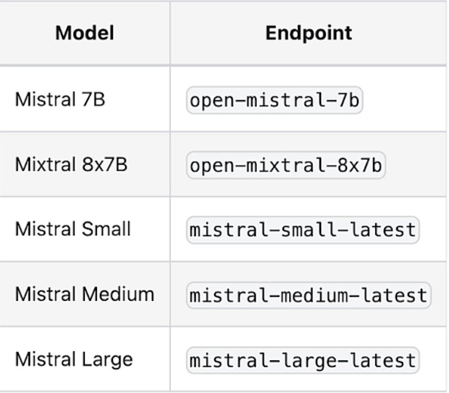

# Model Selection
Mistral AI provides 5 API endpoints featuring 5 leading language models.<br>

<br>
Looking at the model performance such as the Multitask Language Understanding (MMLU) task. Mistral-large outperforms the rest of the models in every benchmark including reasoning, multilingual tasks, mathematics and coding. However performance might not be the only consideration here.
For our applications, we might also want to consider pricing. Mistral offers competitive pricing on their models. And it’s worth considering the performance pricing trade-offs.<br>

**1. Mistral-small →** simple tasks that one can do in bulk (classification, customer support text generation).<br>
**2. Mistral-medium →** intermediate tasks that require moderate reasoning (data extraction, summarizing a document, writing emails, writing a job description, writing product descriptions).<br>
**3. Mistral-large →** complex tasks that require large reasoning capabilities or are highly specialized (synthetic text generation, code generation, RAG, Agents).<br>

```python
from helper import load_mistral_api_key
api_key, dlai_endpoint = load_mistral_api_key(ret_key=True)
```
```python
import os
from mistralai.client import MistralClient
from mistralai.models.chat_completion import ChatMessage

def mistral(user_message, model="mistral-small-latest", is_json=False):
    client = MistralClient(api_key=api_key, endpoint=dlai_endpoint)
    messages = [ChatMessage(role="user", content=user_message)]

    if is_json:
        chat_response = client.chat(
            model=model, messages=messages, response_format={"type": "json_object"}
        )
    else:
        chat_response = client.chat(model=model, messages=messages)

    return chat_response.choices[0].message.content
```
#### Mistral Small
First we will use Mistral-small for simpler tasks like classification.
```python
prompt = """
Classify the following email to determine if it is spam or not.
Only respond with the exact text "Spam" or "Not Spam". 

# Email:
🎉 Urgent! You've Won a $1,000,000 Cash Prize! 
💰 To claim your prize, please click on the link below: 
https://bit.ly/claim-your-prize
"""
```
Let's try to classify an email as spam or not spam.
```python
mistral(prompt, model="mistral-small-latest")
```
`OUTPUT --> 'Spam'`<br>
All the models are good at such tasks but using mistral-small for such tasks is more effective and fast.


#### Mistral Medium
Now we will use Mistral-medium to perform some intermediate tasks like language transformation.
```python
prompt = """
Compose a welcome email for new customers who have just made 
their first purchase with your product. 
Start by expressing your gratitude for their business, 
and then convey your excitement for having them as a customer. 
Include relevant details about their recent order. 
Sign the email with "The Fun Shop Team".

Order details:
- Customer name: Anna
- Product: hat 
- Estimate date of delivery: Feb. 25, 2024
- Return policy: 30 days
"""
```
Here we asking the model to compose emails for new customers who have just made their first purchase with our product. Make sure we have mentioned the order details in the prompt.
```python
response_medium = mistral(prompt, model="mistral-medium-latest")
print(response_medium)
```
```python
OUTPUT --> 
Subject: Welcome to The Fun Shop, Anna! Your Hat is on its Way

Dear Anna,

We are thrilled to welcome you to The Fun Shop community! We are beyond grateful for your decision to make your first purchase with us, and we hope this marks the beginning of a long and enjoyable shopping experience.

We are excited to let you know that your fantastic new hat is on its way! Our team has carefully packaged it, and it's now in the capable hands of our shipping partner. You can expect your hat to arrive at your doorstep by Feb. 25, 2024.

In the meantime, please take a moment to familiarize yourself with our return policy. We believe in customer satisfaction and offer a 30-day return policy, should you need to exchange or return your hat for any reason. If you have any questions or concerns, please don't hesitate to reach out to our friendly customer support team at support@thefunshop.com.

Once again, thank you for choosing The Fun Shop for your shopping needs. We are delighted to have you with us and look forward to serving you in the future.

Best regards,

The Fun Shop Team

www.thefunshop.com
support@thefunshop.com
(123) 456-7890
```


#### Mistral Large
Mistral-large is great for complex tasks that require advanced reasoning capabilities or that are highly specialized. 
```python
prompt = """
Calculate the difference in payment dates between the two \
customers whose payment amounts are closest to each other \
in the following dataset. Do not write code.

# dataset: 
'{
  "transaction_id":{"0":"T1001","1":"T1002","2":"T1003","3":"T1004","4":"T1005"},
    "customer_id":{"0":"C001","1":"C002","2":"C003","3":"C002","4":"C001"},
    "payment_amount":{"0":125.5,"1":89.99,"2":120.0,"3":54.3,"4":210.2},
"payment_date":{"0":"2021-10-05","1":"2021-10-06","2":"2021-10-07","3":"2021-10-05","4":"2021-10-08"},
    "payment_status":{"0":"Paid","1":"Unpaid","2":"Paid","3":"Paid","4":"Pending"}
}'
"""
```
In this example let's ask the model to calculate the difference in payment dates between the two customers whose payment amount are close to each other in a given dataset. First let's try using mistral-small on this task.
```python
response_small = mistral(prompt, model="mistral-small-latest")
print(response_small)
```
```python
OUTPUT --> 
To find the difference in payment dates between the two customers whose payment amounts are closest to each other, follow these steps:

1. Identify the unique payment amounts in the dataset: 125.5, 89.99, 120.0, 54.3, and 210.2
2. Sort these payment amounts: 54.3, 89.99, 120.0, 125.5, 210.2
3. Find the smallest difference between consecutive payment amounts: 120.0 - 89.99 = 30.01 and 125.5 - 120.0 = 5.5. The smallest difference is 5.5.
4. Identify the customers who made these closest payments: For 120.0, it's C003, and for 125.5, it's C001.
5. Find the payment dates for these customers: The payment date for C003 is 2021-10-07, and the payment date for C001 is 2021-10-08.
6. Calculate the difference in payment dates: Subtract the earlier payment date from the later one: 2021-10-08 - 2021-10-07 = 1 day.

Therefore, the difference in payment dates between the two customers whose payment amounts are closest to each other is 1 day.
```
Here we can see that the mistral-small gives incorrect answer. But since the model results are probabilistic if we actually run it multiple times it might sometimes give the correct result.<br>
Now let's try to perform the same task on mistral-medium.
```python
response_medium = mistral(prompt, model="mistral-medium-latest")
print(response_medium)
```
```python
OUTPUT --> 
First, we need to find the two payment amounts that are closest to each other. These are 125.5 and 120.0, which belong to transactions T1001 and T1003 respectively. The payment dates for these transactions are "2021-10-05" and "2021-10-07". To find the difference in payment dates, we need to convert these dates to a numerical format that can be subtracted. Once converted, the difference in payment dates is 2 days.
```
Now let's try out mistral-large
```python
response_large = mistral(prompt, model="mistral-large-latest")
print(response_large)
```
```python
OUTPUT --> 
To solve this problem without writing code, we first need to identify the two customers whose payment amounts are closest to each other. Looking at the dataset, the payment amounts are:

- C001: 125.5, 210.2
- C002: 89.99, 54.3
- C003: 120.0

The closest pair of payments seems to be 125.5 and 120.0 from customers C001 and C003. The difference between these amounts is 5.5.

Next, we need to calculate the difference in payment dates between these two customers. The payment dates are:

- C001: 2021-10-05, 2021-10-08
- C002: 2021-10-06, 2021-10-05
- C003: 2021-10-07

The relevant payment dates for our two customers are 2021-10-05 for C001 and 2021-10-07 for C003. The difference between these dates is 2 days.

So, the difference in payment dates between the two customers whose payment amounts are closest to each other is 2 days.
```
As we can see mistral-large splits the question into multiple steps and is able to give us the right answer.


#### Numerical
Let's try another example in which we will ask the models to calculate expenses on each categories like resturants, groceries, stuffed animals and props.
```python
transactions = """
McDonald's: 8.40
Safeway: 10.30
Carrefour: 15.00
Toys R Us: 20.50
Panda Express: 10.20
Beanie Baby Outlet: 25.60
World Food Wraps: 22.70
Stuffed Animals Shop: 45.10
Sanrio Store: 85.70
"""

prompt = f"""
Given the purchase details, how much did I spend on each category:
1) restaurants
2) groceries
3) stuffed animals and props
{transactions}
"""
```
```python
response_small = mistral(prompt, model="mistral-small-latest")
print(response_small)
```
```python
OUTPUT -->
To calculate your spending in each category, I'll first assign the transactions to their respective categories:

1) Restaurants: McDonald's and Panda Express
   - McDonald's: $8.40
   - Panda Express: $10.20
   Total spent on restaurants: $18.60

2) Groceries: Safeway and Carrefour
   - Safeway: $10.30
   - Carrefour: $15.00
   Total spent on groceries: $25.30

3) Stuffed animals and props: Toys R Us, Beanie Baby Outlet, World Food Wraps, Stuffed Animals Shop, Sanrio Store
   - Toys R Us: $20.50
   - Beanie Baby Outlet: $25.60
   - World Food Wraps: $22.70
   - Stuffed Animals Shop: $45.10
   - Sanrio Store: $85.70
   Total spent on stuffed animals and props: $200.20

So, you spent:
1) $18.60 on restaurants
2) $25.30 on groceries
3) $200.20 on stuffed animals and props
```
Running mistral-small on this we can observe some mistakes in the output. Let's try running mistral-large.
```python
response_large = mistral(prompt, model="mistral-large-latest")
print(response_large)
```
```python
OUTPUT -->
Based on the purchase details you provided, here's the breakdown of your spending in each category:

1) Restaurants:
   - McDonald's: $8.40
   - Panda Express: $10.20
   - World Food Wraps: $22.70
   Total spent on restaurants: $41.30

2) Groceries:
   - Safeway: $10.30
   - Carrefour: $15.00
   Total spent on groceries: $25.30

3) Stuffed animals and props:
   - Toys R Us: $20.50
   - Beanie Baby Outlet: $25.60
   - Stuffed Animals Shop: $45.10
   - Sanrio Store: $85.70
   Total spent on stuffed animals and props: $177.90

So, you spent $41.30 on restaurants, $25.30 on groceries, and $177.90 on stuffed animals and props.
```
Mistral-large gives correct answers for each categories.

#### Writing and Checking Code
```python
user_message = """
Given an array of integers nums and an integer target, return indices of the two numbers such that they add up to target.

You may assume that each input would have exactly one solution, and you may not use the same element twice.

You can return the answer in any order.

Your code should pass these tests:

assert twoSum([2,7,11,15], 9) == [0,1]
assert twoSum([3,2,4], 6) == [1,2]
assert twoSum([3,3], 6) == [0,1]
"""
```
```python
print(mistral(user_message, model="mistral-large-latest"))
```
```python
OUTPUT -->
Here is a Python solution for your problem:

#python
def twoSum(nums, target):
    if len(nums) <= 1:
        return False

    dict_nums = {}
    for i, num in enumerate(nums):
        if num in dict_nums:
            return [dict_nums[num], i]
        else:
            dict_nums[target - num] = i

    return False


This function uses a dictionary to store the numbers in the array and their indices. It then iterates over the array and for each number, it checks if the difference between the target and the current number is in the dictionary. If it is, it means that we have found two numbers that add up to the target and we return their indices. If we finish iterating over the array without finding a pair of numbers that add up to the target, we return False.

The tests you provided can be used to verify the function:

#python
assert twoSum([2,7,11,15], 9) == [0,1]
assert twoSum([3,2,4], 6) == [1,2]
assert twoSum([3,3], 6) == [0,1]
```

#### Natively Fluent in English, French, Spanish, German, and Italian
We can use Mistral models for more than translating from one language to another. If we are a native Spanish speaker, for instance, we can communicate with Mistral models in Spanish for any of our tasks.
```python
user_message = """
Lequel est le plus lourd une livre de fer ou un kilogramme de plume
"""
```
```python
print(mistral(user_message, model="mistral-large-latest"))
```
```python
Une livre de fer et un kilogramme de plumes ont des poids différents.

Une livre (lb) est une unité de poids couramment utilisée aux États-Unis et dans d'autres pays, tandis qu'un kilogramme (kg) est l'unité de poids standard dans le système métrique, utilisé dans le monde entier.

1 kilogramme est approximativement égal à 2,2 livres. Donc, un kilogramme de plumes pèse plus qu'une livre de fer. Cependant, il est important de noter que cela ne signifie pas qu'une seule plume est plus lourde qu'un morceau de fer. La différence de poids provient du fait qu'il y a beaucoup plus de plumes dans un kilogramme que de fer dans une livre.
```

