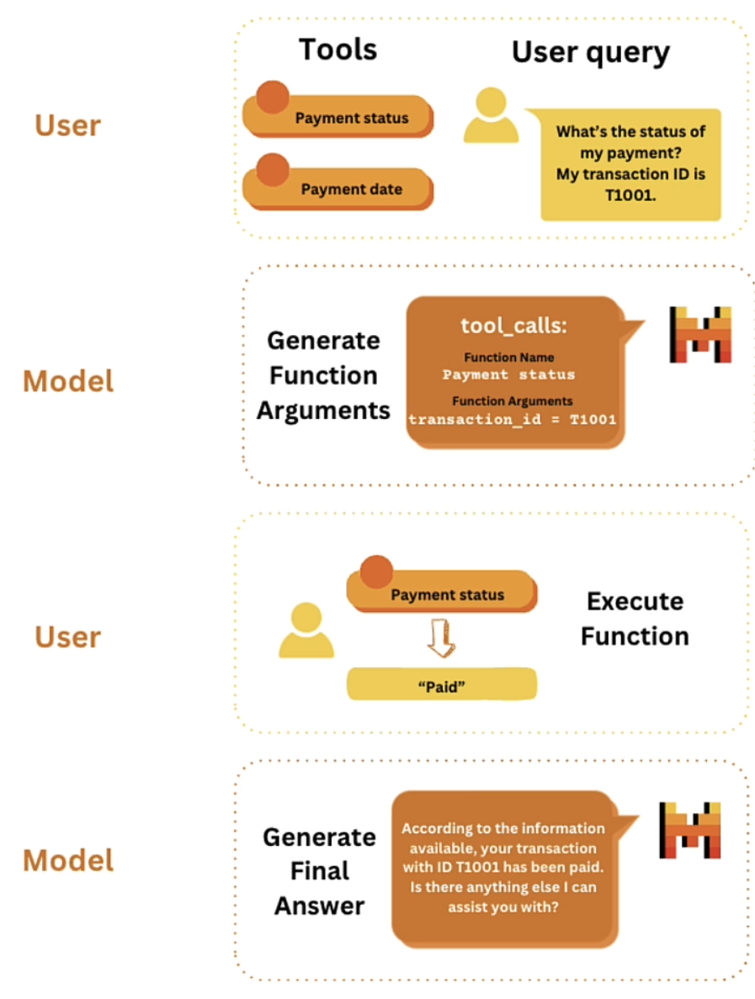

# Function Calling
Function calling allows mistral models to connect to external tools making it easy for us to build applicaitons catering to specific use cases and practical problems.

At high levels there are four steps with function calling:<br>
<br>
1. For users to define tools and use a query. A tool can be a user defined function or an external API. For example, users can write two functions to extract the payment status and payment date information, and then when the user asks a question, what's the status of my payment? This question is directly related to the payment status tool, and we should use this tool to address the question.<br>
2. For a mistral model to generate function arguments. When applicable, based on the tools and the user query, our model is able to determine that the function we should use is payment status and the function argument is transaction ID equals T1001.<br>
3. For users to execute the function to obtain two results. We simply pass the function arguments directly in the function, and we get the result from the function which is paid in this example.<br>
4. For a model to generate a final answer according to the information available, your transaction ID T1001 has been paid. Is there anything else I can assist you with?<br>

```python
!pip install pandas "mistralai>=0.1.2"
```
```python
import pandas as pd
from helper import load_mistral_api_key
api_key, dlai_endpoint = load_mistral_api_key(ret_key=True)
```

```python
data = {
    "transaction_id": ["T1001", "T1002", "T1003", "T1004", "T1005"],
    "customer_id": ["C001", "C002", "C003", "C002", "C001"],
    "payment_amount": [125.50, 89.99, 120.00, 54.30, 210.20],
    "payment_date": [
        "2021-10-05",
        "2021-10-06",
        "2021-10-07",
        "2021-10-05",
        "2021-10-08",
    ],
    "payment_status": ["Paid", "Unpaid", "Paid", "Paid", "Pending"],
}
df = pd.DataFrame(data)

transaction_id = "T1001"

prompt = f"""
Given the following data, what is the payment status for \
 transaction_id={transaction_id}?

data:
{data}
"""
```
To ask questions about this data without function calling, we could simplly pass this data in the prompt and then ask the question. Given the following: "data what is the payment status for the transaction ID, which is T1001?".
```python
import os
from mistralai.client import MistralClient
from mistralai.models.chat_completion import ChatMessage


def mistral(user_message, model="mistral-small-latest", is_json=False):
    client = MistralClient(api_key=api_key, endpoint=dlai_endpoint)
    messages = [ChatMessage(role="user", content=user_message)]

    if is_json:
        chat_response = client.chat(
            model=model, messages=messages, response_format={"type": "json_object"}
        )
    else:
        chat_response = client.chat(model=model, messages=messages)

    return chat_response.choices[0].message.content
```
```python
response = mistral(prompt)
print(response)
```
`OUTPUT --> The payment status for transaction_id=T1001 is "Paid".`<br>
In real use cases we have huge number of transactions and passing this amount of data may exceed the context window size. A more efficient, affordable and reliable way to do this is to use function calling to run the code. To perform this kind of search. We just need to prompt the LLM to know when to call each function.

### 1. User: specify tools and query
First define all the necessary tools for users use cases.
```python
import json
def retrieve_payment_status(df: data, transaction_id: str) -> str:
    if transaction_id in df.transaction_id.values:
        return json.dumps(
            {"status": df[df.transaction_id == transaction_id].payment_status.item()}
        )
    return json.dumps({"error": "transaction id not found."})
```
```python
status = retrieve_payment_status(df, transaction_id="T1001")
print(status)
```
`OUTPUT --> {"status": "Paid"}`<br>
For example here we have a function retrieve payment status. If we define the function argument, transaction ID is T1001. We get the status paid from this function.

```python
def retrieve_payment_date(df: data, transaction_id: str) -> str:
    if transaction_id in df.transaction_id.values:
        return json.dumps(
            {"date": df[df.transaction_id == transaction_id].payment_date.item()}
        )
    return json.dumps({"error": "transaction id not found."})
```
```python
date = retrieve_payment_date(df, transaction_id="T1002")
print(date)
```
`OUTPUT --> {"date": "2021-10-06"}`<br>
We have another example, we can retrieve the payment date information based on a transaction ID. And then we get the date.

So how do Mistral models understand these functions?. For these models to understand these function we can align the function specs with a JSON schema.
```python
tool_payment_status = {
    "type": "function",
    "function": {
        "name": "retrieve_payment_status",
        "description": "Get payment status of a transaction",
        "parameters": {
            "type": "object",
            "properties": {
                "transaction_id": {
                    "type": "string",
                    "description": "The transaction id.",
                }
            },
            "required": ["transaction_id"],
        },
    },
}
```
This is the JSON schema for the function retrieve payment status. Specify the tool type  which has a function in this case, the function name. The function description. This will tell the model. What does this function do. The parameters of the function, which includes the argument of the function. The type of the argument and the description of the argument. Also specify the required function argument, which is the transaction ID here. 
```python
tool_payment_date = {
    "type": "function",
    "function": {
        "name": "retrieve_payment_date",
        "description": "Get payment date of a transaction",
        "parameters": {
            "type": "object",
            "properties": {
                "transaction_id": {
                    "type": "string",
                    "description": "The transaction id.",
                }
            },
            "required": ["transaction_id"],
        },
    },
}
```
Similarly define the JSON schema for retrieve payment date.
```python
tools = [tool_payment_status, tool_payment_date]
```
Then combine both the JSON specs into a list called tools.

### functools
```python
import functools
names_to_functions = {
    "retrieve_payment_status": functools.partial(retrieve_payment_status, df=df),
    "retrieve_payment_date": functools.partial(retrieve_payment_date, df=df),
}
names_to_functions["retrieve_payment_status"](transaction_id="T1001")
```
Here we have organized the two functions into a dictionary, where the keys represent the funciton name and the values are the functions with the data frame defined. This allows us to call each function based on its function name.<br>
We can call the retrieve payment status function with the argument transaction ID equals to T1001. Using this name to function dictionary. Next we need to define a user query.
```python
from mistralai.models.chat_completion import ChatMessage

chat_history = [
    ChatMessage(role="user", content="What's the status of my transaction?")
]
```
Suppose a user asks the following question: "What's the status of my transaction?". A stand alone LLM will not be able to answer this question. As it doesn't have the business logic backend to access the necessary data. But what if we have the exact tool we can use to answer this question?

### 2. Model: Generate function arguments
```python
from mistralai.client import MistralClient

model = "mistral-large-latest"

client = MistralClient(api_key=os.getenv("MISTRAL_API_KEY"), endpoint=os.getenv("DLAI_MISTRAL_API_ENDPOINT"))

response = client.chat(
    model=model, messages=chat_history, tools=tools, tool_choice="auto"
)

response
```
```python
OUTPUT -->
ChatCompletionResponse(id='6f17f55167df4b8cbcfe4a90bbcde387', object='chat.completion', created=1715441235, model='mistral-large-latest', choices=[ChatCompletionResponseChoice(index=0, message=ChatMessage(role='assistant', content="To find out the status of your transaction, I'll need the transaction ID. Could you please provide it?", name=None, tool_calls=None), finish_reason=<FinishReason.stop: 'stop'>)], usage=UsageInfo(prompt_tokens=161, total_tokens=184, completion_tokens=23))
```
```python
response.choices[0].message.content
```
```python
OUTPUT --> "To find out the status of your transaction, I'll need the transaction ID. Could you please provide it?"
```
So how do Mistral model know about these functions and know which function to use? We provvide both the user query and the tool specs to the models. We can have the language model to automatically choose if we should use a tool or not by setting `tool_choice` to "auto" or "any" and if we don't what to use any we can pass "none" to prevent tool use.<br>
To check the status of the transaction I need the transaction ID. Could you please provide it? As we can see the model was able to identify if there is any essential information missing for the function and it will ask for this essential information.

```python
chat_history.append(
    ChatMessage(role="assistant", content=response.choices[0].message.content)
)
chat_history.append(ChatMessage(role="user", content="My transaction ID is T1001."))
chat_history
```
We can save the history of the conversation we have in the chat history and add a user message and add a transaction ID T1001.

### 3. User: Execute function to obtain tool results
Currently it is the users responsibilty to execute the function and the function execution lies on the user side.
```python
tool_function = response.choices[0].message.tool_calls[0].function
print(tool_function)
```
`OUTPUT --> name='retrieve_payment_status' arguments='{"transaction_id": "T1001"}'`
```python
tool_function.name
```
`OUTPUT --> 'retrieve_payment_status'`
```python
tool_function.arguments
```
`OUTPUT --> '{"transaction_id": "T1001"}'`<br>
We get the function name and its arguments. The function arguments are expected to be in a Python dictionary and not a string. To make this string into a dictionary, we can use **`json.loads()`**.
```python
args = json.loads(tool_function.arguments)
print(args)
```
`OUTPUT --> {'transaction_id': 'T1001'}`
```python
function_result = names_to_functions[tool_function.name](**args)
function_result
```
`OUTPUT --> '{"status": "Paid"}'`<br>
We can get the function results based on its name and arguments, we will get the result status as paid. We can append it into the chat history.

### 4. Model: Generate final answer
```python
response = client.chat(model=model, messages=chat_history)
response.choices[0].message.content
```
`OUTPUT --> "The status of your transaction with the ID T1001 is 'Paid'."`
Give the model the entire chat history and it will return a personalized answer.

These are the four steps of function calling. Mistral model also provides **parallel function calling**. For example in user message, id we ask for both the **status** and the **date** of the transaction ID T1001. The model will respond with two function calls.  
