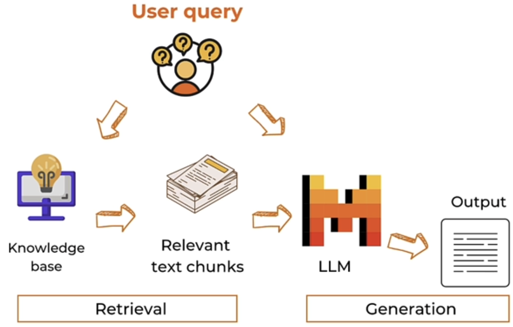

# Retrieval Augmented Generation (RAG)
Retrieval Augmented Generation is an AI framework that combines the capabilities of LLM and information retrieval systems. It is useful to answer questions or generate content leveraging external knowledge.
Why do we need RAG? LLMs can face a lot of challenges, it doesn’t have access to our internal document, it doesn’t have the most up to date information and it can hallucinate. One of the potential solutions for these problems is RAG.
When users ask a question about an internal document or a knowledge base, we retrieve relevant information from the knowledge base, where all the text embeddings are stored in a vector store, this step is called retrieval. Then in a prompt we include both the user query and the relevant information, so that our model can generate output based on the relevant context, this step is called generation.  
<br>
```python
! pip install faiss-cpu "mistralai>=0.1.2"
from helper import load_mistral_api_key
api_key, dlai_endpoint = load_mistral_api_key(ret_key=True)
```
```python
import requests
from bs4 import BeautifulSoup
import re

response = requests.get(
    "https://www.deeplearning.ai/the-batch/a-roadmap-explores-how-ai-can-detect-and-mitigate-greenhouse-gases/"
)
html_doc = response.text
soup = BeautifulSoup(html_doc, "html.parser")
tag = soup.find("div", re.compile("^prose--styled"))
text = tag.text
print(text)
```
We will import an article and we use an HTML parser called **`Beautifulsoup`** to find the main text of the article.
```python
file_name = "AI_greenhouse_gas.txt"
with open(file_name, 'w') as file:
    file.write(text)
```
Save the text into a text file.
```python
chunk_size = 512
chunks = [text[i : i + chunk_size] for i in range(0, len(text), chunk_size)]
```
Let's split the document into chunks. It is crucial to do so in a RAG system to be able to more effectively identify and retrieve the most relevant piece of information. Here we will simple split the text **by character** combining 512 characters into each chunk. Depending on our specific use cases it may be necessary to customize or experiment with different chunk sizes. Also there are various ootions in terms of how we split the text. We can split by tokens, sentences, HTML headers and others depending on our application. After this we have to make embeddings for each of these chunks.
```python
import os
from mistralai.client import MistralClient


def get_text_embedding(txt):
    client = MistralClient(api_key=api_key, endpoint=dlai_endpoint)
    embeddings_batch_response = client.embeddings(model="mistral-embed", input=txt)
    return embeddings_batch_response.data[0].embedding
```

We define the `get_text_embedding()` function using the Mistral embeddings API endpoint to get embedding from a single text chunk.
```python
import numpy as np

text_embeddings = np.array([get_text_embedding(chunk) for chunk in chunks])
```
Then we use the list comprehension to get text embeddings for all text chunks. The embedding are of 1024 dimension.
```python
import faiss

d = text_embeddings.shape[1]
index = faiss.IndexFlatL2(d)
index.add(text_embeddings)
```
For storing the embeddings in **vector database** we will use **Faiss** library, this is a common practice to store the embeddings for efficient processing and retrieval. With Faiss we define an instance of index class with the embedding dimension as the argument. We then add the text embeddings to the indexing structure. 
```python
question = "What are the ways that AI can reduce emissions in Agriculture?"
question_embeddings = np.array([get_text_embedding(question)])
```
When user asks question, we also need to create embeddings for this question using the same embedding model as before. Now we can retireve text chunks from the vector database that's similar to the question we asked.
```python
D, I = index.search(question_embeddings, k=2)
print(I)
```
We can perform a search on the vector database with `index.search`. This function returns the distances and the indices of the **k** most similar vectors to the question vector in the vector database.
```python
retrieved_chunk = [chunks[i] for i in I.tolist()[0]]
print(retrieved_chunk)
```
Then based on the return indices, we can retrieve the actual relevant text chunks that correspond to those indices. In the response we get two text chunks because we defined **k=2** to retireve the two most similar vectors in the vector database.<br>
There are lot of different retireval strategies. Here we used a simple similarity search with embeddings. Depending on our use case sometimes we might want to perform **metadata filtering** first, or provide weights to the retrieved documents, or retrieve a larger parent child that original retrieved chunks belong to.
```python
prompt = f"""
Context information is below.
---------------------
{retrieved_chunk}
---------------------
Given the context information and not prior knowledge, answer the query.
Query: {question}
Answer:
"""
```
Finally we can offer the retrieved text chunks as the context information within the prompt. In the prompt template we can include both the retrieved text chunks and the user question in a prompt.
```python
from mistralai.models.chat_completion import ChatMessage


def mistral(user_message, model="mistral-small-latest", is_json=False):
    client = MistralClient(api_key=api_key, endpoint=dlai_endpoint)
    messages = [ChatMessage(role="user", content=user_message)]

    if is_json:
        chat_response = client.chat(
            model=model, messages=messages, response_format={"type": "json_object"}
        )
    else:
        chat_response = client.chat(model=model, messages=messages)

    return chat_response.choices[0].message.content
```
```python
response = mistral(prompt)
print(response)
```
With the prompt we get a response. And this is how RAG works from scratch.


If we are developing a complex application where RAG is one of the tools we can call, or if we have multiple RAGs as multiple tools we can call, then we may consider using RAG in setup function calling.
```python
def qa_with_context(text, question, chunk_size=512):
    # split document into chunks
    chunks = [text[i : i + chunk_size] for i in range(0, len(text), chunk_size)]
    # load into a vector database
    text_embeddings = np.array([get_text_embedding(chunk) for chunk in chunks])
    d = text_embeddings.shape[1]
    index = faiss.IndexFlatL2(d)
    index.add(text_embeddings)
    # create embeddings for a question
    question_embeddings = np.array([get_text_embedding(question)])
    # retrieve similar chunks from the vector database
    D, I = index.search(question_embeddings, k=2)
    retrieved_chunk = [chunks[i] for i in I.tolist()[0]]
    # generate response based on the retrieve relevant text chunks

    prompt = f"""
    Context information is below.
    ---------------------
    {retrieved_chunk}
    ---------------------
    Given the context information and not prior knowledge, answer the query.
    Query: {question}
    Answer:
    """
    response = mistral(prompt)
    return response
```
The above function is a wrap up of the RAG knowledge.
```python
import functools

names_to_functions = {"qa_with_context": functools.partial(qa_with_context, text=text)}
```
Then we organize this function into a dictionary, this might not look that useful with just one function, but if we have multiple tools or functions, this is very useful to organize them into one dictionary.
```python
tools = [
    {
        "type": "function",
        "function": {
            "name": "qa_with_context",
            "description": "Answer user question by retrieving relevant context",
            "parameters": {
                "type": "object",
                "properties": {
                    "question": {
                        "type": "string",
                        "description": "user question",
                    }
                },
                "required": ["question"],
            },
        },
    },
]
```
We can outline the function specs with a JSON schema to tell the model what this function is about. 
```python
question = """
What are the ways AI can mitigate climate change in transportation?
"""

client = MistralClient(api_key=api_key, endpoint=dlai_endpoint)

response = client.chat(
    model="mistral-large-latest",
    messages=[ChatMessage(role="user", content=question)],
    tools=tools,
    tool_choice="any",
)

response
```
```python
tool_function = response.choices[0].message.tool_calls[0].function
tool_function
```
Now we pass the user question and the tool to the model, we get two call results with the function name and the arguments in our user question.
```python
import json

args = json.loads(tool_function.arguments)
args
```
`OUTPUT --> {'question': 'What are the ways AI can mitigate climate change in transportation?'}`<br>
```python
function_result = names_to_functions[tool_function.name](**args)
function_result
```

## More about RAG
To learn about more advanced chunking and retrieval methods, check out:
- [Advanced Retrieval for AI with Chroma](https://learn.deeplearning.ai/courses/advanced-retrieval-for-ai/lesson/1/introduction)
  - Sentence window retrieval
  - Auto-merge retrieval
- [Building and Evaluating Advanced RAG Applications](https://learn.deeplearning.ai/courses/building-evaluating-advanced-rag)
  - Query Expansion
  - Cross-encoder reranking
  - Training and utilizing Embedding Adapters
