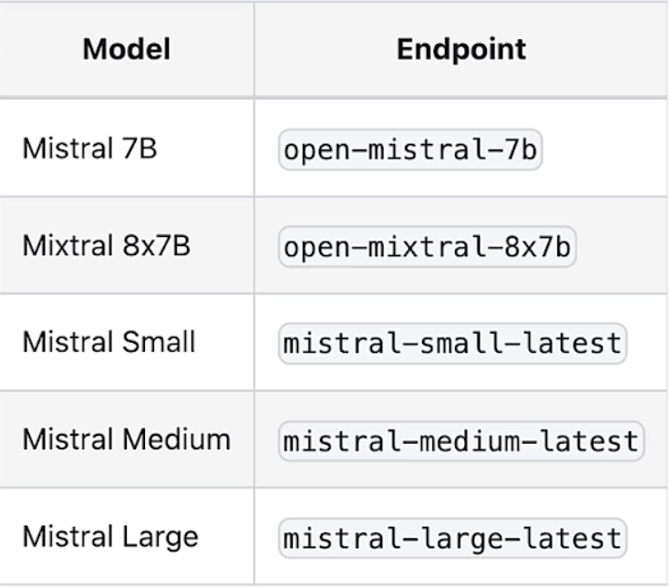
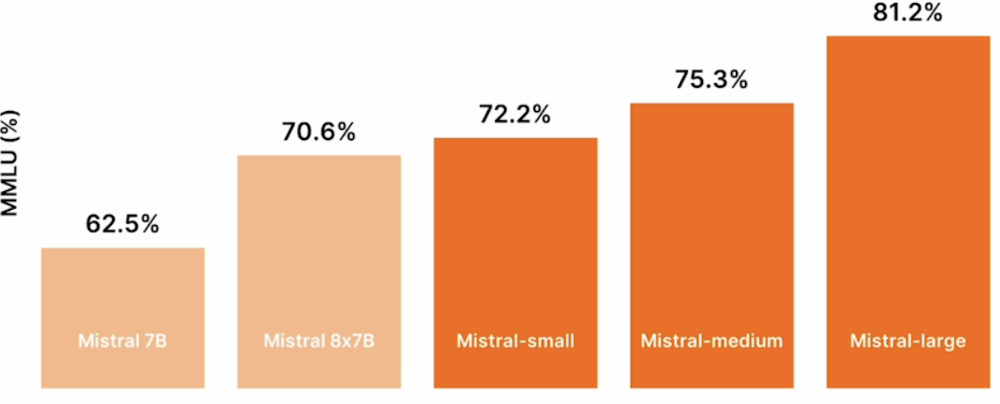
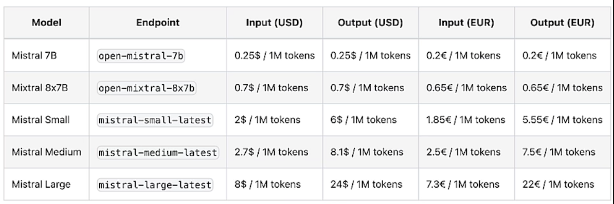

# Mistral-AI
Many popular and very effective LLMs are built on the standard transformer architecture, but one of the open source models released by **Mistral (Mistral 8x7B)** modifies the standard transformer architecture using a **mixture of experts**. There are **8 distinct Feed Forward Neural Networks** called experts, and at inference time a different **Gating Neural Network** first chooses to activate two of these eight experts to run to predict the next token. It then takes the **weighted average** of these to expert outputs in order to actually generate that next token. This mixture of expert design allows the Mistral model to have both the **performance improvements** of larger models while having **inference costs** comparable to a smaller model. Even though the Mixtral model has **46.7B parameters** at inference time, it only uses **12.9B** of those parameters to predict each token.<br>
When we integrate an LLM into a larger software application, it is often very helpful for the LLM's output to be easily fed into downstream software systems by having it open as response in a structured JSON format. For some LLMs users may rely on clever prompting or using a framework like **LangChain-a-LlamaIndex** to guarantee a reliable JSON format in the response. Mixtral has a reliable feature to generate responses in the JSON format that we request. 

## Overview
Mistral offers **6 models** for all use cases and business needs that we can download their weights and use it anywhere without any restrictions. **Mistral 7B** which fits on one GPU outperforms **LLaMa model** with similar and even greater sizes. **Mistral 8x7B** is a sparse mixture of expert models. The foundation of this model is a transformer block consisting of 2 layers, feed forward layer and multi head attention layer. Each input token goes through the same layers. We duplicate the feed forward layer N times. To decide which input token goes to which layer we use a router to map each token to the top K feed forward layers and ignore the rest. As a result, even though Mistral has **46.7B parameters**, it only uses **12.9B parameters** per token providing great performance with fast inference. It outperforms **LLaMa 2.70B** and most benchmarks with **8x** faster inference and it matches or outperforms **GPT 3.5** at most standard benchmarks. These models are under the open source **Apache 2.0 License** means we can download the model weights of both models, fine tune and customize them for our own use cases and use them without any restrictions.<br>
Mistral also offers 4 optimized enterprise-grade models. **Mistral Small** is best for lower latency use cases, **Mistral Medium** is suitable for our language based tasks, **Mistral Large** is the flagship model for our most sophisticated needs with advanced reasoning capabilities, it approaches the performance of **GPT-4** and outperforms also has native multilingual capabilities, it offers a **32K tokens** context window. Finally the Embedding Model which offers the SOTA embeddings for text and can be used for many use cases like clustering and classification. We can chat with the Mistral models in **chat.mistral.ai**. To use these models in code we can use **transformers, llama.cpp** or **ollama**. To setup the API key goto **console.mistral.ai**.

## 1. Prompting Capabilities
Prompt the mistral models via API calls and perform various tasks like classification information extraction, personalization and summarization.<br>
```python
!pip install mistralai
from helper import load_mistral_api_key
load_mistral_api_key()
```

```python
from helper import mistral
mistral("hello, what can you do?")
```
`OUTPUT -->  "Hello! I'm here to help answer your questions, provide information, offer explanations, and even share a joke or two. I can assist with a wide range of topics, including but not limited to, general knowledge, science, history, literature, math, and more. I can also help explain concepts, solve problems, and offer guidance on various subjects. What can I assist you with today?"`

### Classification
```python
prompt = """
    You are a bank customer service bot. 
    Your task is to assess customer intent and categorize customer 
    inquiry after <<<>>> into one of the following predefined categories:
    
    card arrival
    change pin
    exchange rate
    country support 
    cancel transfer
    charge dispute
    
    If the text doesn't fit into any of the above categories, 
    classify it as:
    customer service
    
    You will only respond with the predefined category. 
    Do not provide explanations or notes. 
    
    ###
    Here are some examples:
    
    Inquiry: How do I know if I will get my card, or if it is lost? I am concerned about the delivery process and would like to ensure that I will receive my card as expected. Could you please provide information about the tracking process for my card, or confirm if there are any indicators to identify if the card has been lost during delivery?
    Category: card arrival
    Inquiry: I am planning an international trip to Paris and would like to inquire about the current exchange rates for Euros as well as any associated fees for foreign transactions.
    Category: exchange rate 
    Inquiry: What countries are getting support? I will be traveling and living abroad for an extended period of time, specifically in France and Germany, and would appreciate any information regarding compatibility and functionality in these regions.
    Category: country support
    Inquiry: Can I get help starting my computer? I am having difficulty starting my computer, and would appreciate your expertise in helping me troubleshoot the issue. 
    Category: customer service
    ###
    
    <<<
    Inquiry: {inquiry}
    >>>
    Category:
"""
```
In the above prompt our task is to assess customer intent and categorize customer inquiry. We have a list of predefined categories. If the text doesn't fit in any of the categories, classify it as customer service.
In the above prompt we first assign a **role play** to the model as a `bank customer service bot` this adds personal context to the model. Next we used **few shot learning** where we give some exapmples in the prompts. This can improve model's performance, especially when the task is difficult or when we want the model to respond in a specific manner.<br>
We use demminetors like **'###'** and **'<<<'** to specify the boundary between diferent sections of the text. In our example, we use the '###' to indicate examples and '<<<' to indicate customer inquiry.
Finally in a case when the model is **verbose**, we can add: "do not provide explanations or notes", to make sure the output is concise.

#### If we want to make sure that our prompt doesn't have any grammetical mistake, ask Mistral to check the spelling and grammar of the prompt
```python
response = mistral(f"Please correct the spelling and grammar of \
this prompt and return a text that is the same prompt,\
with the spelling and grammar fixed: {prompt}")
print(response)
```

```python
OUTPUT -->
You are a bank customer service bot. Your task is to assess customer intent and categorize the customer inquiry following the inquiry text into one of the following predefined categories:

card arrival
change PIN
exchange rate
country support
cancel transfer
charge dispute

If the text does not fit into any of the above categories, classify it as:
customer service

You will only respond with the predefined category. Do not provide explanations or notes.

###
Here are some examples:

Inquiry: How do I know if I will get my card, or if it is lost? I am concerned about the delivery process and would like to ensure that I will receive my card as expected. Could you please provide information about the tracking process for my card, or confirm if there are any indicators to identify if the card has been lost during delivery?
Category: card arrival
Inquiry: I am planning an international trip to Paris and would like to inquire about the current exchange rates for Euros as well as any associated fees for foreign transactions.
Category: exchange rate
Inquiry: What countries are getting support? I will be traveling and living abroad for an extended period of time, specifically in France and Germany, and would appreciate any information regarding compatibility and functionality in these regions.
Category: country support
Inquiry: Can I get help starting my computer? I am having difficulty starting my computer, and would appreciate your expertise in helping me troubleshoot the issue.
Category: customer service
###

<<<
Inquiry: {inquiry}
>>>
Category:
```

Now using the corrected prompt let's try out the model by passing the inquiry which will enter in `{inquiry}`.<br>
```python
mistral(
    response.format(
        inquiry="I am inquiring about the availability of your cards in the EU"))
```
`OUTPUT --> 'country support'`

```python
mistral(
    response.format(
        inquiry="What is the weather of today?"))
```
`OUTPUT --> 'customer service'`<br>
As this query doesn't matches any of the predefined categories, the model correctly categorize it as a customer service.

### Information Extraction with JSON Mode
```python
medical_notes = """
A 60-year-old male patient, Mr. Johnson, presented with symptoms
of increased thirst, frequent urination, fatigue, and unexplained
weight loss. Upon evaluation, he was diagnosed with diabetes,
confirmed by elevated blood sugar levels. Mr. Johnson's weight
is 210 lbs. He has been prescribed Metformin to be taken twice daily
with meals. It was noted during the consultation that the patient is
a current smoker. 
"""
```
The above text is of some medical information and we would like to extract some information from this text.
```python
prompt = f"""
Extract information from the following medical notes:
{medical_notes}

Return json format with the following JSON schema: 

{{
        "age": {{
            "type": "integer"
        }},
        "gender": {{
            "type": "string",
            "enum": ["male", "female", "other"]
        }},
        "diagnosis": {{
            "type": "string",
            "enum": ["migraine", "diabetes", "arthritis", "acne"]
        }},
        "weight": {{
            "type": "integer"
        }},
        "smoking": {{
            "type": "string",
            "enum": ["yes", "no"]
        }}
}}
"""
```
In this prompt, we provide the medical notes and ask the model to return JSON format with the following JSON schema, where we define what we want to extract, the type of this variable and the list of output options. So for diagnosis, the model should output one of the four options provided in diagnosis section.<br>
In this promt we explicitly ask to return JSON format. It is important to ask for the JSON format when we enable the JSON mode. Another strategy we use here, is that we define thte JSON schema. We use this JSON schema in the prompt to ensure the consistency and structure of the JSON output. Note that if we don't have the `is_JSON=True` the output may still be a JSON format, but it is recommended to enable the JSON mode to return a reliable JSON format.
```python
response = mistral(prompt, is_json=True)
print(response)
```
`OUTPUT --> {"age": 60, "gender": "male", "diagnosis": "diabetes", "weight": 210, "smoking": "yes"}`

### Personalization
LLMs are really good at personalization tasks, let's see how the model can create personalized email responses to address customer questions.
```python
email = """
Dear mortgage lender, 

What's your 30-year fixed-rate APR, how is it compared to the 15-year 
fixed rate?

Regards,
Anna
"""
```
The above text is an email where the customer 'Anna' is asking the mortgage lender about the mortgage rate.
```python
prompt = f"""

You are a mortgage lender customer service bot, and your task is to 
create personalized email responses to address customer questions.
Answer the customer's inquiry using the provided facts below. Ensure 
that your response is clear, concise, and directly addresses the 
customer's question. Address the customer in a friendly and 
professional manner. Sign the email with "Lender Customer Support."   
      
# Facts
30-year fixed-rate: interest rate 6.403%, APR 6.484%
20-year fixed-rate: interest rate 6.329%, APR 6.429%
15-year fixed-rate: interest rate 5.705%, APR 5.848%
10-year fixed-rate: interest rate 5.500%, APR 5.720%
7-year ARM: interest rate 7.011%, APR 7.660%
5-year ARM: interest rate 6.880%, APR 7.754%
3-year ARM: interest rate 6.125%, APR 7.204%
30-year fixed-rate FHA: interest rate 5.527%, APR 6.316%
30-year fixed-rate VA: interest rate 5.684%, APR 6.062%

# Email
{email}
"""
```
In the above prompt we have provided some numbers about the interest rates in the prompts. We use the string format to add the actual email content to this email variable at the end.
```python
response = mistral(prompt)
print(response)
```

```python
OUTPUT -->
Subject: Mortgage Rates Inquiry - Your 30-Year and 15-Year Fixed-Rate Options

Dear Anna,

Thank you for reaching out with your mortgage rate inquiry. I'm happy to provide you with the current interest rates and Annual Percentage Rates (APRs) for our fixed-rate mortgage products.

For a 30-year fixed-rate mortgage, the current interest rate is 6.403%, and the APR is 6.484%. On the other hand, for a 15-year fixed-rate mortgage, the interest rate is 5.705%, and the APR is 5.848%.

When comparing the two options, you'll notice that the 15-year fixed-rate mortgage offers a lower interest rate and APR than the 30-year fixed-rate mortgage. This is because, with a 15-year term, you'll be paying off your loan in half the time, resulting in less interest being accrued over the life of your loan. However, please keep in mind that while the monthly payments for a 15-year mortgage are higher than those for a 30-year mortgage, you will build equity in your home faster and pay less in total interest over the life of the loan.

I hope this information is helpful, and I'm here to answer any other questions you may have. If you're ready to move forward, please let me know, and I can guide you through the next steps.

Best regards,

Lender Customer Support
```
We can see that we get a personalized email to Anna answering her questions based on the facts provided. With this kind of prompt, we can easily create our own customer service bot. Answer questions about our product. It is important to use clear and concise language when presenting these facts or your product information. This can help the model to provide accurate and quick responses to customer queries.


### Summarization
- We'll use this [article](https://www.deeplearning.ai/the-batch/mistral-enhances-ai-landscape-in-europe-with-microsoft-partnership-and-new-language-models) from The Batch.
Summarization is a common task for LLMs, and Mistral model can do a really good job as summarization.
```python
newsletter = """
European AI champion Mistral AI unveiled new large language models and formed an alliance with Microsoft. 

What’s new: Mistral AI introduced two closed models, Mistral Large and Mistral Small (joining Mistral Medium, which debuted quietly late last year). Microsoft invested $16.3 million in the French startup, and it agreed to distribute Mistral Large on its Azure platform and let Mistral AI use Azure computing infrastructure. Mistral AI makes the new models available to try for free here and to use on its La Plateforme and via custom deployments.

Model specs: The new models’ parameter counts, architectures, and training methods are undisclosed. Like the earlier, open source Mistral 7B and Mixtral 8x7B, they can process 32,000 tokens of input context. 

Mistral Large achieved 81.2 percent on the MMLU benchmark, outperforming Anthropic’s Claude 2, Google’s Gemini Pro, and Meta’s Llama 2 70B, though falling short of GPT-4. Mistral Small, which is optimized for latency and cost, achieved 72.2 percent on MMLU.
Both models are fluent in French, German, Spanish, and Italian. They’re trained for function calling and JSON-format output.
Microsoft’s investment in Mistral AI is significant but tiny compared to its $13 billion stake in OpenAI and Google and Amazon’s investments in Anthropic, which amount to $2 billion and $4 billion respectively.
Mistral AI and Microsoft will collaborate to train bespoke models for customers including European governments.
Behind the news: Mistral AI was founded in early 2023 by engineers from Google and Meta. The French government has touted the company as a home-grown competitor to U.S.-based leaders like OpenAI. France’s representatives in the European Commission argued on Mistral’s behalf to loosen the European Union’s AI Act oversight on powerful AI models. 

Yes, but: Mistral AI’s partnership with Microsoft has divided European lawmakers and regulators. The European Commission, which already was investigating Microsoft’s agreement with OpenAI for potential breaches of antitrust law, plans to investigate the new partnership as well. Members of President Emmanuel Macron’s Renaissance party criticized the deal’s potential to give a U.S. company access to European users’ data. However, other French lawmakers support the relationship.

Why it matters: The partnership between Mistral AI and Microsoft gives the startup crucial processing power for training large models and greater access to potential customers around the world. It gives the tech giant greater access to the European market. And it gives Azure customers access to a high-performance model that’s tailored to Europe’s unique regulatory environment.

We’re thinking: Mistral AI has made impressive progress in a short time, especially relative to the resources at its disposal as a startup. Its partnership with a leading hyperscaler is a sign of the tremendous processing and distribution power that remains concentrated in the large, U.S.-headquartered cloud companies.
"""

prompt = f"""
You are a commentator. Your task is to write a report on a newsletter. 
When presented with the newsletter, come up with interesting questions to ask,
and answer each question. 
Afterward, combine all the information and write a report in the markdown
format. 

# Newsletter: 
{newsletter}

# Instructions: 
## Summarize:
In clear and concise language, summarize the key points and themes 
presented in the newsletter.

## Interesting Questions: 
Generate three distinct and thought-provoking questions that can be 
asked about the content of the newsletter. For each question:
- After "Q: ", describe the problem 
- After "A: ", provide a detailed explanation of the problem addressed 
in the question.
- Enclose the ultimate answer in <>.

## Write a analysis report
Using the summary and the answers to the interesting questions, 
create a comprehensive report in Markdown format. 
"""
```
We have given the `{newsletter}` and provided some instructions followed by some questions to be answered and lastly to write an analysis report of the article. These instructions help the model to think in each step and generate a more comprehensive report.
```python
response = mistral(prompt)
print(response)
```

```python
OUTPUT -->
# Summary
Mistral AI, a European AI startup, introduced two new large language models, Mistral Large and Mistral Small, and formed a strategic alliance with Microsoft. Microsoft has invested $16.3 million in Mistral AI and agreed to distribute Mistral Large on its Azure platform while allowing Mistral AI to use Azure's computing infrastructure. Mistral AI's new models outperformed several competitors on the MMLU benchmark but fell short of GPT-4. The partnership between Mistral AI and Microsoft has been met with mixed reactions from European lawmakers and regulators.

# Interesting Questions

Q: How does Mistral AI's performance on the MMLU benchmark compare to other leading AI models?

A: Mistral AI's performance on the MMLU benchmark is impressive, with Mistral Large achieving 81.2% and Mistral Small achieving 72.2%. However, it still falls short of GPT-4. Compared to other models like Anthropic’s Claude 2, Google’s Gemini Pro, and Meta’s Llama 2 70B, Mistral Large outperforms, demonstrating the startup's competitive edge.

<Mistral AI's performance on the MMLU benchmark is competitive but still trails GPT-4.>

Q: What are the potential implications of Microsoft's investment in Mistral AI for the European AI market and regulatory environment?

A: Microsoft's investment in Mistral AI could potentially give the tech giant greater access to the European market, while also providing Azure customers with a high-performance model tailored to Europe's unique regulatory environment. However, the partnership has also raised concerns among European lawmakers and regulators about potential data privacy issues and breaches of antitrust law.

<Microsoft's investment in Mistral AI could lead to increased market access and a high-performance model for Azure customers, but it has also raised regulatory concerns.>

Q: How does Mistral AI's partnership with Microsoft reflect the current landscape of AI development and distribution?

A: Mistral AI's partnership with a leading hyperscaler like Microsoft is a testament to the significant processing and distribution power that remains concentrated in large, U.S.-headquartered cloud companies. Despite being a European startup, Mistral AI has turned to a U.S. company for crucial processing power and greater customer access.

<Mistral AI's partnership with Microsoft reflects the current landscape of AI development and distribution, where significant power remains concentrated in large, U.S.-headquartered cloud companies.>

# Analysis Report

## Mistral AI Unveils New Models and Partners with Microsoft

European AI startup, Mistral AI, has recently introduced two new large language models, Mistral Large and Mistral Small, and formed a strategic alliance with Microsoft. This partnership has significant implications for the European AI market and the broader AI landscape.

### Performance on MMLU Benchmark

Mistral AI's new models have shown impressive performance on the MMLU benchmark. While Mistral Large's score of 81.2% falls short of GPT-4, it outperforms other leading models like Anthropic’s Claude 2, Google’s Gemini Pro, and Meta’s Llama 2 70B. Mistral Small, optimized for latency and cost, scored 72.2% on the MMLU benchmark, demonstrating the startup's competitive edge.

### Microsoft's Investment and Regulatory Implications

Microsoft's $16.3 million investment in Mistral AI could provide the tech giant with greater access to the European market. It also offers Azure customers a high-performance model tailored to Europe's unique regulatory environment. However, this partnership has raised concerns among European lawmakers and regulators about potential data privacy issues and breaches of antitrust law. The European Commission, which was already investigating Microsoft’s agreement with OpenAI, plans to investigate the new partnership as well.

### AI Development and Distribution Landscape

Mistral AI's partnership with Microsoft reflects the current landscape of AI development and distribution, where significant power remains concentrated in large, U.S.-headquartered cloud companies. Despite being a European startup, Mistral AI has turned to a U.S. company for crucial processing power and greater customer access. This highlights the challenges faced by European AI startups in competing with their U.S. counterparts.

In conclusion, Mistral AI's new models and partnership with Microsoft represent a significant step forward for the European AI startup. However, it also underscores the challenges and potential pitfalls of EU-U.S. AI collaborations, particularly in terms of competition and regulation.
```


### The Mistral Python client
- Below is the helper function that we imported from helper.py and used in this notebook.
- For more details, check out the [Mistral AI API documentation](https://docs.mistral.ai/api/)
- To get our own Mistral AI API key to use on our own, we can create an account and go to the [console](https://console.mistral.ai/) to subscribe and create an API key.
```python
from mistralai.client import MistralClient
from mistralai.models.chat_completion import ChatMessage   

def mistral(user_message, 
            model="mistral-small-latest",
            is_json=False):
    client = MistralClient(api_key=os.getenv("MISTRAL_API_KEY"))
    messages = [ChatMessage(role="user", content=user_message)]

    if is_json:
        chat_response = client.chat(
            model=model, 
            messages=messages,
            response_format={"type": "json_object"})
    else:
        chat_response = client.chat(
            model=model, 
            messages=messages)
        
    return chat_response.choices[0].message.content
```


## 2. Model Selection
Mistral AI provides 5 API endpoints featuring 5 leading language models.<br>

<br>
Looking at the model performance such as the Multitask Language Understanding (MMLU) task. Mistral-large outperforms the rest of the models in every benchmark including reasoning, multilingual tasks, mathematics and coding. However performance might not be the only consideration here.
For our applications, we might also want to consider pricing. Mistral offers competitive pricing on their models. And it’s worth considering the performance pricing trade-offs.<br>

**1. Mistral-small →** simple tasks that one can do in bulk (classification, customer support text generation).<br>
**2. Mistral-medium →** intermediate tasks that require moderate reasoning (data extraction, summarizing a document, writing emails, writing a job description, writing product descriptions).<br>
**3. Mistral-large →** complex tasks that require large reasoning capabilities or are highly specialized (synthetic text generation, code generation, RAG, Agents).<br>

```python
from helper import load_mistral_api_key
api_key, dlai_endpoint = load_mistral_api_key(ret_key=True)
```
```python
import os
from mistralai.client import MistralClient
from mistralai.models.chat_completion import ChatMessage

def mistral(user_message, model="mistral-small-latest", is_json=False):
    client = MistralClient(api_key=api_key, endpoint=dlai_endpoint)
    messages = [ChatMessage(role="user", content=user_message)]

    if is_json:
        chat_response = client.chat(
            model=model, messages=messages, response_format={"type": "json_object"}
        )
    else:
        chat_response = client.chat(model=model, messages=messages)

    return chat_response.choices[0].message.content
```
#### Mistral Small
First we will use Mistral-small for simpler tasks like classification.
```python
prompt = """
Classify the following email to determine if it is spam or not.
Only respond with the exact text "Spam" or "Not Spam". 

# Email:
🎉 Urgent! You've Won a $1,000,000 Cash Prize! 
💰 To claim your prize, please click on the link below: 
https://bit.ly/claim-your-prize
"""
```
Let's try to classify an email as spam or not spam.
```python
mistral(prompt, model="mistral-small-latest")
```
`OUTPUT --> 'Spam'`
All the models are good at such tasks but using mistral-small for such tasks is more effective and fast.<br>


#### Mistral Medium
Now we will use Mistral-medium to perform some intermediate tasks like language transformation.
```python
prompt = """
Compose a welcome email for new customers who have just made 
their first purchase with your product. 
Start by expressing your gratitude for their business, 
and then convey your excitement for having them as a customer. 
Include relevant details about their recent order. 
Sign the email with "The Fun Shop Team".

Order details:
- Customer name: Anna
- Product: hat 
- Estimate date of delivery: Feb. 25, 2024
- Return policy: 30 days
"""
```
Here we asking the model to compose emails for new customers who have just made their first purchase with our product. Make sure we have mentioned the order details in the prompt.
```python
response_medium = mistral(prompt, model="mistral-medium-latest")
print(response_medium)
```
`OUTPUT --> 
Subject: Welcome to The Fun Shop, Anna! Your Hat is on its Way

Dear Anna,

We are thrilled to welcome you to The Fun Shop community! We are beyond grateful for your decision to make your first purchase with us, and we hope this marks the beginning of a long and enjoyable shopping experience.

We are excited to let you know that your fantastic new hat is on its way! Our team has carefully packaged it, and it's now in the capable hands of our shipping partner. You can expect your hat to arrive at your doorstep by Feb. 25, 2024.

In the meantime, please take a moment to familiarize yourself with our return policy. We believe in customer satisfaction and offer a 30-day return policy, should you need to exchange or return your hat for any reason. If you have any questions or concerns, please don't hesitate to reach out to our friendly customer support team at support@thefunshop.com.

Once again, thank you for choosing The Fun Shop for your shopping needs. We are delighted to have you with us and look forward to serving you in the future.

Best regards,

The Fun Shop Team

www.thefunshop.com
support@thefunshop.com
(123) 456-7890
`


#### Mistral Large
Mistral-large is great for complex tasks that require advanced reasoning capabilities or that are highly specialized. 
```python
prompt = """
Calculate the difference in payment dates between the two \
customers whose payment amounts are closest to each other \
in the following dataset. Do not write code.

# dataset: 
'{
  "transaction_id":{"0":"T1001","1":"T1002","2":"T1003","3":"T1004","4":"T1005"},
    "customer_id":{"0":"C001","1":"C002","2":"C003","3":"C002","4":"C001"},
    "payment_amount":{"0":125.5,"1":89.99,"2":120.0,"3":54.3,"4":210.2},
"payment_date":{"0":"2021-10-05","1":"2021-10-06","2":"2021-10-07","3":"2021-10-05","4":"2021-10-08"},
    "payment_status":{"0":"Paid","1":"Unpaid","2":"Paid","3":"Paid","4":"Pending"}
}'
"""
```
In this example let's ask the model to calculate the difference in payment dates between the two customers whose payment amount are close to each other in a given dataset. First let's try using mistral-small on this task.
```python
response_small = mistral(prompt, model="mistral-small-latest")
print(response_small)
```
`OUTPUT --> 
To find the difference in payment dates between the two customers whose payment amounts are closest to each other, follow these steps:

1. Identify the unique payment amounts in the dataset: 125.5, 89.99, 120.0, 54.3, and 210.2
2. Sort these payment amounts: 54.3, 89.99, 120.0, 125.5, 210.2
3. Find the smallest difference between consecutive payment amounts: 120.0 - 89.99 = 30.01 and 125.5 - 120.0 = 5.5. The smallest difference is 5.5.
4. Identify the customers who made these closest payments: For 120.0, it's C003, and for 125.5, it's C001.
5. Find the payment dates for these customers: The payment date for C003 is 2021-10-07, and the payment date for C001 is 2021-10-08.
6. Calculate the difference in payment dates: Subtract the earlier payment date from the later one: 2021-10-08 - 2021-10-07 = 1 day.

Therefore, the difference in payment dates between the two customers whose payment amounts are closest to each other is 1 day.
`
Here we can see that the mistral-small gives incorrect answer. But since the model results are probabilistic if we actually run it multiple times it might sometimes give the correct result.<br>
Now let's try to perform the same task on mistral-medium.
```python
response_medium = mistral(prompt, model="mistral-medium-latest")
print(response_medium)
```
`OUTPUT --> 
First, we need to find the two payment amounts that are closest to each other. These are 125.5 and 120.0, which belong to transactions T1001 and T1003 respectively. The payment dates for these transactions are "2021-10-05" and "2021-10-07". To find the difference in payment dates, we need to convert these dates to a numerical format that can be subtracted. Once converted, the difference in payment dates is 2 days.
`
Now let's try out mistral-large
```python
response_large = mistral(prompt, model="mistral-large-latest")
print(response_large)
```
`OUTPUT --> 
To solve this problem without writing code, we first need to identify the two customers whose payment amounts are closest to each other. Looking at the dataset, the payment amounts are:

- C001: 125.5, 210.2
- C002: 89.99, 54.3
- C003: 120.0

The closest pair of payments seems to be 125.5 and 120.0 from customers C001 and C003. The difference between these amounts is 5.5.

Next, we need to calculate the difference in payment dates between these two customers. The payment dates are:

- C001: 2021-10-05, 2021-10-08
- C002: 2021-10-06, 2021-10-05
- C003: 2021-10-07

The relevant payment dates for our two customers are 2021-10-05 for C001 and 2021-10-07 for C003. The difference between these dates is 2 days.

So, the difference in payment dates between the two customers whose payment amounts are closest to each other is 2 days.
`
As we can see mistral-large splits the question into multiple steps and is able to give us the right answer.
